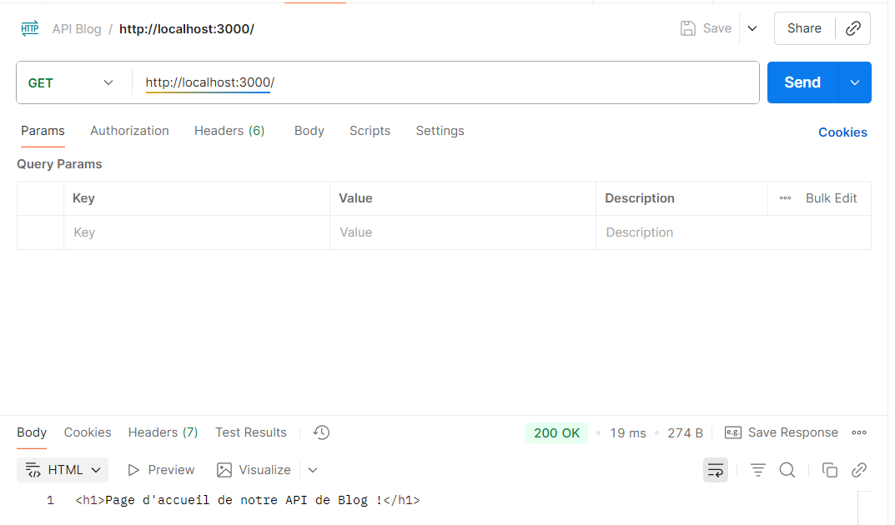
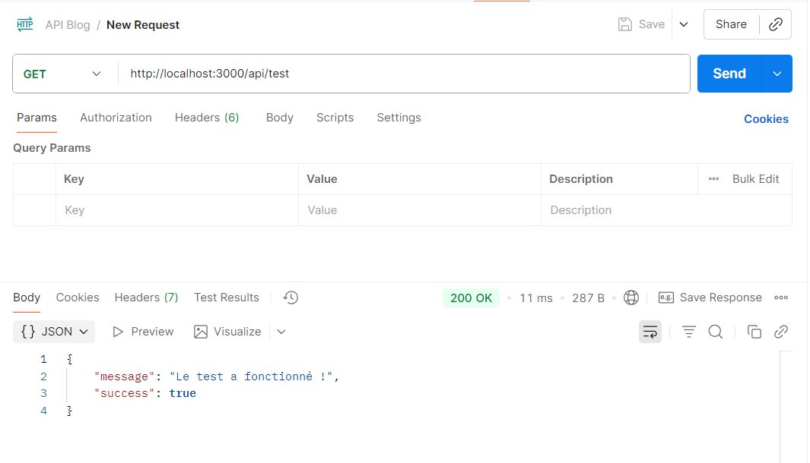
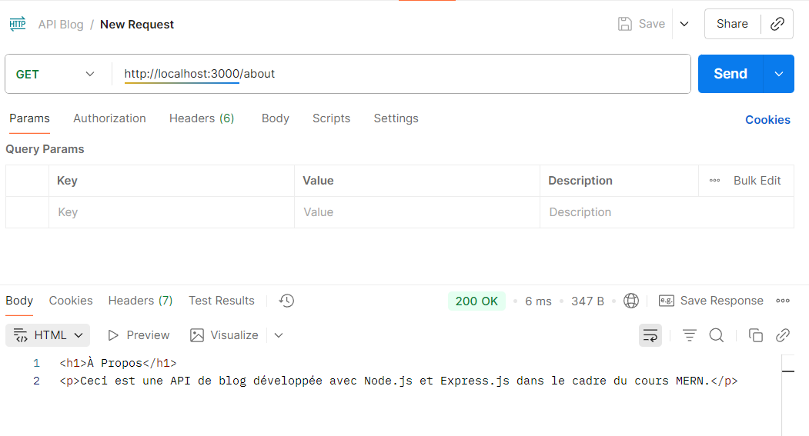
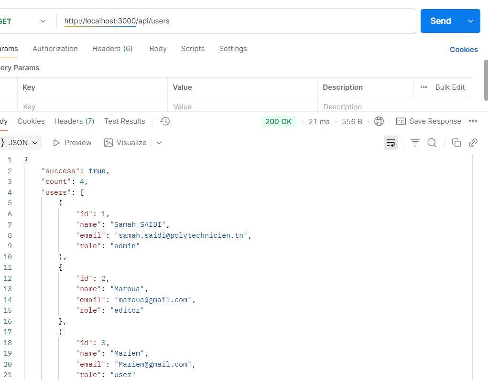
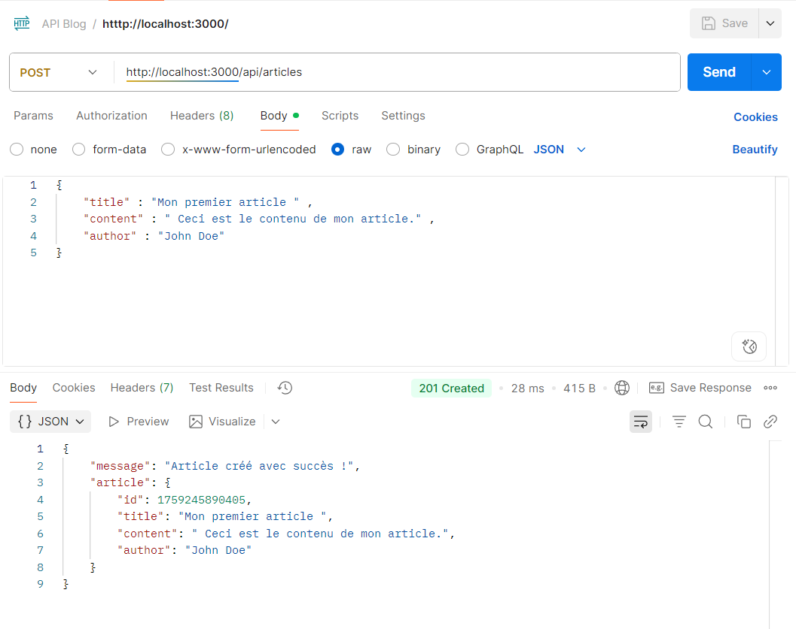
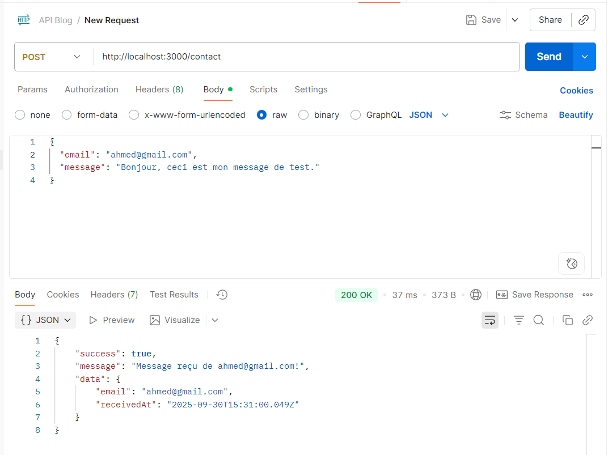
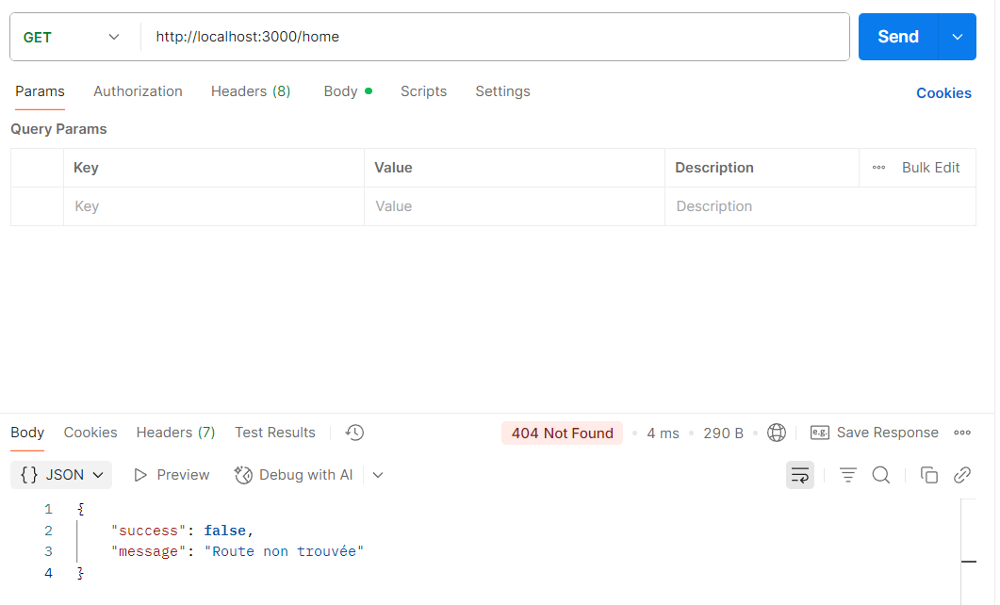

# TP MERN Semaine 1

## Fondations Back-end avec Node.js et Express

---

## 📋 Étape 1 : Configuration de l'Environnement

### 1.1 Vérifier Node.js et npm

Ouvrez un terminal et tapez :

```bash
node -v
npm -v
```

Vous devriez voir les versions installées (ex: v18.x.x ou v20.x.x)

### 1.2 Extensions VS Code Recommandées

- **ESLint** : Analyse de code en temps réel
- **Prettier** : Formatage automatique
- **DotENV** : Support des fichiers .env
- **GitLens** : Intégration Git avancée

---

## 🚀 Étape 2 : Création du Projet

### 2.1 Créer le dossier du projet

```bash
mkdir mon-api-blog
cd mon-api-blog
```

### 2.2 Initialiser le projet Node.js

```bash
npm init -y
```

Cette commande crée le fichier `package.json`

### 2.3 Installer les dépendances

```bash
# Express (framework web)
npm install express

# Nodemon (redémarrage automatique en développement)
npm install nodemon --save-dev
```

### 2.4 Modifier package.json

Ouvrez `package.json` et ajoutez dans la section `"scripts"` :

```json
"scripts": {
  "start": "node server.js",
  "dev": "nodemon server.js"
}
```

---

## 📝 Étape 3 : Créer le Serveur

### 3.1 Créer server.js

Créez un fichier `server.js` à la racine du projet et copiez le code fourni dans l'artifact "server.js - Serveur Express Complet".

### 3.2 Comprendre la Structure

**Middleware express.json()** : Permet de lire le corps des requêtes POST au format JSON

```javascript
app.use(express.json());
```

**Routes GET** : Pour récupérer des données

```javascript
app.get("/chemin", (req, res) => {
  res.json({ data: "valeur" });
});
```

**Routes POST** : Pour envoyer des données

```javascript
app.post("/chemin", (req, res) => {
  const data = req.body; // Les données envoyées
  res.json({ message: "Succès" });
});
```

---

## ▶️ Étape 4 : Démarrer le Serveur

### 4.1 Lancer en mode développement

```bash
npm run dev
```

Vous devriez voir :

```
Serveur démarré sur http://localhost:5000

```

---

## 🧪 Étape 5 : Tester avec Postman

### 5.1 Créer une Collection

1. Ouvrez Postman
2. Créez une nouvelle Collection "API Blog"

### 5.2 Test Route GET /

- **Méthode** : GET
- **URL** : `http://localhost:3000/`
- **Résultat attendu** : Page HTML d'accueil
  

### 5.3 Test Route GET /api/test

- **Méthode** : GET
- **URL** : `http://localhost:3000/api/test`
- **Résultat attendu** :

```json
{
  "message": "Le test a fonctionné!",
  "success": true
}
```



### 5.4 Test Route GET /about

- **Méthode** : GET
- **URL** : `http://localhost:3000/about`
- **Résultat attendu** : Page HTML "À propos"



### 5.5 Test Route GET /api/users

- **Méthode** : GET
- **URL** : `http://localhost:3000/api/users`
- **Résultat attendu** : Liste d'utilisateurs en JSON



### 5.6 Test Route POST /api/articles

- **Méthode** : POST
- **URL** : `http://localhost:3000/api/articles`
- **Body** : Sélectionnez "raw" et "JSON", puis :

```json
{
  "title": "Mon premier article",
  "content": "Ceci est le contenu de mon article.",
  "author": "John Doe"
}
```

- **Résultat attendu** : Status 201 avec l'article créé



### 5.7 Test Route POST /contact

- **Méthode** : POST
- **URL** : `http://localhost:3000/contact`
- **Body** : Sélectionnez "raw" et "JSON", puis :

```json
{
  "email": "exemple@email.com",
  "message": "Bonjour, ceci est mon message de test."
}
```

- **Résultat attendu** :

```json
{
  "success": true,
  "message": "Message reçu de exemple@email.com!",
  "data": {
    "email": "exemple@email.com",
    "receivedAt": "2025-09-30T..."
  }
}
```



---

## ✅ Travail Pratique Complété

Le code fourni inclut TOUTES les fonctionnalités demandées :

### ✓ Route "À Propos"

- Route GET `/about` créée
- Renvoie une page HTML décrivant l'API

### ✓ Route API Utilisateurs

- Route GET `/api/users` créée
- Renvoie un tableau de 4 utilisateurs factices avec id, nom, email et rôle

### ✓ Route Contact POST

- Route POST `/contact` créée
- Accepte `email` et `message` dans le corps JSON
- Validation de l'email (format et présence)
- Répond avec l'email reçu dans le message de succès

---

## 📊 Architecture du Projet Actuelle

```
mon-api-blog/
├── images/                # Les captures d'écran du résultats
├── node_modules/          # Dépendances (généré automatiquement)
├── package.json           # Configuration du projet
├── package-lock.json      # Verrouillage des versions
└── server.js              # Point d'entrée de l'application
```

---

## 🔍 Concepts Clés à Retenir

### 1. Architecture API-First

L'API est développée en premier, avant toute interface utilisateur.

### 2. Event Loop de Node.js

- **Single-threaded** : Un seul processus principal
- **Non-bloquant** : Les opérations I/O n'arrêtent pas l'exécution
- **Asynchrone** : Gestion efficace de nombreuses requêtes simultanées

### 3. Middleware Express

Les middlewares sont des fonctions qui s'exécutent entre la réception d'une requête et l'envoi de la réponse :

```javascript
app.use(express.json()); // Middleware global
```

### 4. Codes de Statut HTTP

- **200 OK** : Succès (GET)
- **201 Created** : Ressource créée avec succès (POST)
- **400 Bad Request** : Erreur de validation
- **404 Not Found** : Route inexistante



### 5. RESTful API

- **GET** : Récupérer des données
- **POST** : Créer des données
- **PUT/PATCH** : Modifier des données
- **DELETE** : Supprimer des données

---

## 🎯 Points à Inclure dans le Compte Rendu

### Description du Travail Réalisé

1. Configuration de l'environnement (Node.js, VS Code, Postman)
2. Initialisation du projet avec `npm init -y`
3. Installation d'Express et Nodemon
4. Création du fichier server.js avec toutes les routes
5. Tests des routes avec Postman

### Commandes Utilisées

```bash
# Vérification des versions
node -v
npm -v

# Création et navigation
mkdir mon-api-blog
cd mon-api-blog

# Initialisation
npm init -y

# Installation des dépendances
npm install express
npm install nodemon --save-dev

# Démarrage du serveur
npm run dev
```

### Explication des Concepts

**1. Pourquoi express.json() ?**
Sans ce middleware, `req.body` serait `undefined` pour les requêtes POST. Il parse automatiquement le JSON reçu.

**2. Différence entre app.get() et app.post() ?**

- `app.get()` : Récupère des données (lecture seule)
- `app.post()` : Envoie des données pour création/modification

**3. Rôle de nodemon ?**
Redémarre automatiquement le serveur à chaque modification du code, ce qui accélère le développement.

**4. Qu'est-ce qu'une route ?**
Un point d'entrée de l'API défini par une méthode HTTP et un chemin (ex: GET /api/users).

**5. Pourquoi l'architecture MVC future ?**
Séparer les préoccupations rend le code plus maintenable, testable et évolutif.

---

## 🚨 Erreurs Courantes et Solutions

### Erreur : "Cannot GET /"

**Cause** : Le serveur n'est pas démarré
**Solution** : Lancez `npm run dev`

### Erreur : "express is not defined"

**Cause** : Express n'est pas installé
**Solution** : `npm install express`

### Erreur : req.body est undefined

**Cause** : Middleware express.json() manquant ou mal placé
**Solution** : Ajoutez `app.use(express.json())` AVANT les routes POST

### Erreur : Port 3000 déjà utilisé

**Cause** : Un autre processus utilise le port
**Solution** : Changez le PORT dans server.js ou arrêtez l'autre processus

---

## 🔗 Connexion avec un Front Indépendant

Pour consommer cette API depuis un projet front (React, Vite, Next.js) séparé :

### 1) Backend (.env)

Créez un fichier `.env` à la racine du backend avec par exemple :

```
PORT=5000
CORS_ORIGINS=http://localhost:5173,http://localhost:3000
```

Le serveur autorisera ces origines via CORS et écoutera sur `http://localhost:5000`.

### 2) Front Vite (React, Vue, etc.)

Dans le projet front, créez `.env` :

```
VITE_API_URL=http://localhost:5000
```

Appelez l’API :

```js
// Exemple avec fetch
const res = await fetch(`${import.meta.env.VITE_API_URL}/api/articles`);
const data = await res.json();

// Exemple avec axios
import axios from "axios";
const api = axios.create({
  baseURL: import.meta.env.VITE_API_URL,
  withCredentials: true,
});
const { data: articles } = await api.get("/api/articles");
```

Option proxy (dev) dans `vite.config.ts/js` :

```ts
export default {
  server: {
    proxy: {
      "/api": "http://localhost:5000",
    },
  },
};
```

### 3) Front Create React App (CRA)

Dans `.env` :

```
REACT_APP_API_URL=http://localhost:5000
```

Utilisation :

```js
fetch(`${process.env.REACT_APP_API_URL}/api/users`).then((r) => r.json());
```

Option proxy (dev) dans `package.json` du front :

```json
{
  "proxy": "http://localhost:5000"
}
```

### 4) Front Next.js

Dans `.env.local` :

```
NEXT_PUBLIC_API_URL=http://localhost:5000
```

Utilisation côté client :

```js
const res = await fetch(`${process.env.NEXT_PUBLIC_API_URL}/api/articles`);
```

Option rewrites (dev) dans `next.config.js` :

```js
module.exports = {
  async rewrites() {
    return [
      {
        source: "/api/:path*",
        destination: "http://localhost:5000/api/:path*",
      },
    ];
  },
};
```

### 5) Cookies / Auth (optionnel)

Si vous utilisez des cookies (sessions, JWT en cookie) :

- Activez `credentials` côté front (`fetch` avec `credentials: 'include'`, axios avec `withCredentials: true`).
- Gardez `credentials: true` côté backend (déjà configuré).
- En production HTTPS, les cookies doivent être `SameSite=None; Secure`.

## 👩‍💻 Auteur

Samah Saidi - Développeur Data Science

📧 Contact: samah.saidi@polytechnicien.tn

🔗 GitHub: https://github.com/samah-saidi
